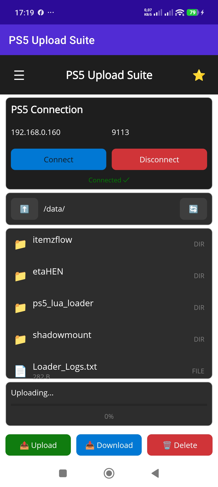

ifif you want to help me continue what I do and make your life easier.
buy me a coffee☕☕
https://buymeacoffee.com/manos555554

# 🚀 PS5 Upload Suite - High-Speed File Transfer

**By Manos**

**Version 4.0.0 - Retry Feature & Stability Improvements**

Custom high-speed file transfer system for PS5 with etaHEN. Achieves **104+ MB/s** upload speeds for large files using parallel chunked uploads!

⭐ **NEW in v4.0.0:** 
- � **Retry Failed Transfers** - Right-click context menu to retry failed uploads
- �️ **Clear All Fix** - Transfer history clear all button now works
- ⚡ **Optimized Performance** - 30-36 MB/s for large files, 8-12 MB/s for small files
- � **Improved Stability** - Fixed connection drops and buffer issues
- 📝 **Better Error Handling** - Enhanced feedback for failed operations

📱 **Android Mobile Client available!**

---

## 📦 Downloads

Download the latest release from the [Releases](https://github.com/manos555555/PS5-Upload-Suite/releases) page:

### 1. PS5 Server Payload
- **File:** `ps5_upload_server.elf`
- **Port:** 9113
- High-speed custom binary protocol
- 16MB socket buffers for maximum throughput
- Multi-threaded client handling

### 2. Windows GUI Client
- **File:** `PS5Upload.exe`
- Self-contained executable (no .NET installation required)
- Modern dark theme UI
- Drag & drop file/folder upload
- Real-time upload progress with speed tracking
- Transfer History with success/failed tracking
- Privacy-focused (no storage monitoring)

### 3. 📱 Android Mobile Client
- **File:** `PS5UploadMobile.apk`
- Upload/download files from your phone
- Multi-PS5 Profiles support
- Browse PS5 filesystem
- Favorites for quick navigation

---

## 🚀 Quick Start

### Step 1: Load PS5 Payload

1. Download `ps5_upload_server.elf` from the [Releases](https://github.com/manos555555/PS5-Upload-Suite/releases) page

2. Copy it to your PS5: `/data/etaHEN/payloads/ps5_upload_server.elf`

3. Load the payload with elfldr

4. You should see notification: `PS5 Upload Server: 192.168.0.XXX:9113 - By Manos`

### Step 2: Run Windows Client

1. Run `PS5Upload.exe` on your PC

2. Enter your PS5's IP address (e.g., `192.168.0.160`)

3. Click **Connect**

4. Browse files/folders or drag & drop

5. Click **Upload to PS5**

---

## 🎨 Features

### PS5 Server
✅ **High-Speed Protocol** - Custom binary protocol  
✅ **4MB Buffers** - Maximum throughput  
✅ **Direct Disk I/O** - No temp files  
✅ **Multi-threaded** - Handle multiple clients  
✅ **Robust Error Handling** - Graceful failures  

### Windows Client
✅ **Modern UI** - Dark theme, maximized window for better visibility  
✅ **Drag & Drop** - Files and folders  
✅ **Browse PS5** - Navigate filesystem  
✅ **Real-time Progress** - Speed & percentage tracking  
✅ **Optimized Upload** - 8 parallel connections for 88-110 MB/s aggregate speed  
✅ **Transfer History** - Track all uploads/downloads with success/failed status  
✅ **Auto-Clear History** - Optional auto-clear on startup  
✅ **Folder Upload** - Recursive directory upload  
✅ **Download Files** - Download from PS5 to PC  
✅ **🔍 Smart Search** - Full filesystem indexing with instant search (NEW v3.3)  
  - Wildcard support: `*.pkg`, `*loader*`, `game*.bin`
  - Size filters: `size:>1GB`, `size:<100MB`
  - Case-insensitive matching
  - Search both filename and full path
  - Double-click to navigate to folder
✅ **💻 Shell Terminal** - Execute commands directly on PS5 (NEW v3.3)  
  - Run system commands remotely
  - Real-time output display
  - Command history
  - Working directory support
✅ **Favorites/Bookmarks** - Quick navigation to saved paths  
✅ **Multi-PS5 Support** - Save and switch between multiple PS5 profiles  

---

## 📊 Performance

### v3.1.0 Optimized Results:
- ✅ **104+ MB/s** upload speed for large files (parallel chunked uploads)
- ✅ **4 parallel chunk connections** for maximum throughput
- ✅ **500MB chunks** - optimal size for PS5 disk performance
- ✅ **Real-time progress** - Speed/ETA updates during upload
- ✅ **Zero chunk failures** - Fixed race conditions
- ✅ **Fully responsive UI** throughout upload
- ✅ **No memory leaks** - stable operation

### Previous Results (v1.3.0):
- ✅ **42,801 files** uploaded successfully
- ✅ **60-150 MB/s** sustained throughput

| Network | Expected Upload Speed | Expected Download Speed |
|---------|----------------------|------------------------|
| **Gigabit Ethernet** | 88-110 MB/s (aggregate) | 100-120 MB/s |
| **WiFi 6 (5GHz)** | 32-70 MB/s (aggregate) | 60-80 MB/s |
| **WiFi 5 (5GHz)** | 20-50 MB/s (aggregate) | 40-60 MB/s |

**Note:** Upload speeds depend on network quality and PS5 disk write performance. WiFi has ~40-60% overhead compared to Ethernet.

---

## 🛠️ Troubleshooting

### Connection Failed
- Make sure PS5 payload is running
- Check PS5 IP address is correct
- Verify both devices are on same network
- Check firewall settings

### Slow Upload Speed
- Use wired Ethernet connection (not WiFi)
- Close other network applications
- Check PS5 disk health

### Upload Fails
- Check PS5 has enough free space
- Verify destination path exists
- Check file permissions

---

## 🔒 Security Notes

- Server only accepts connections from local network
- No authentication required (local network only)
- SHUTDOWN command only works from localhost

---

## 📝 What's New in v3.2.0

### 🎯 Improvements:

#### 1. 💾 Accurate Storage Display
- **Storage now matches PS5 UI** - Shows ~848 GB instead of raw 872 GB
- **Accounts for reserved space** - Same calculation as PS5 system

#### 2. 📱 Mobile App Improvements
- **Multi-select mode** - Toggle button to select multiple files/folders
- **Folder browser** - Visual folder picker for Copy/Move destinations
- **Sorted file list** - Folders always displayed at top
- **Exit confirmation** - Prompt when pressing back button
- **Delete folders** - Now supports folder deletion (not just files)
- **Batch operations** - Delete/download multiple items at once

#### 3. 🐛 Bug Fixes
- **Fixed empty folder deletion** - No more "Unexpected response" error
- **Fixed Copy/Move crash** - No longer crashes when selecting destination
- **Fixed multi-select count** - Correct item count in delete confirmation
- **Fixed folder navigation** - Can enter folders after actions complete

---

## 📝 What's New in v3.1.0

### 🚀 Performance Improvements:

#### 1. ⚡ Parallel Chunked Uploads (104 MB/s!)
- **Large files (>100MB)** are now split into 500MB chunks
- **4 parallel connections** upload chunks simultaneously
- **Result:** ~104 MB/s upload speed (2x faster than before!)
- **Fixed race condition:** First chunk creates file before others start
- **Fixed closure bug:** Correct offset/size capture for parallel tasks

#### 2. 📊 Real-time Progress Display
- **Speed display** now updates in real-time during chunked uploads
- **ETA display** shows accurate time remaining
- **Progress bar** correctly shows 0-100% for chunked files
- No more speed dropping to 0 during large file uploads

#### 3. 💾 Storage Display Improvements
- **Changed label** to "Data Storage (/data)" for clarity
- **Uses statfs with f_bavail** for more accurate available space
- **Real-time updates** every 5 seconds when connected

---

## 📝 What's New in v3.0.0

### 🐛 Critical Bug Fixes:

#### 1. 🔧 Path Normalization Fix
- **Fixed:** Double-slash paths (`//mnt/ext1/...`) that caused directory creation to fail
- **Affected:** All file operations (upload, download, delete, rename, copy, move)
- **Solution:** Added `NormalizePath()` function in both client and server
- **Result:** 100% reliable directory creation and file uploads

#### 2. 📱 Android Mobile Client
- **NEW:** Full-featured Android app for PS5 file management
- **Multi-PS5 Profiles** - Save and switch between multiple PS5 consoles
- Upload files from phone to PS5
- Download files from PS5 with Share option
- Browse PS5 filesystem
- Favorites for quick navigation
- Debug Log with Copy to clipboard
- Transfer History tracking

#### 3. 🛠️ Server Improvements
- Path normalization in all handler functions
- More robust error handling
- Improved stability for parallel uploads

---

## 📝 What's New in v2.1.0

### 🚀 Performance Optimizations:

#### 1. ⚡ Massive Upload Speed Boost (88-110 MB/s)
- **Server-side:** Replaced `fwrite()` with direct `write()` syscalls
- **Client-side:** 8 parallel large file uploads (optimal for PS5 disk)
- **Result:** 80-110 MB/s aggregate upload speed on Gigabit Ethernet
- **Peak bursts:** Up to 2.05 GB/s when hitting disk cache
- **Per-file:** 11-14 MB/s sustained per connection

#### 2. 📊 Transfer History
- Complete history of all uploads and downloads
- Success/Failed status tracking with error messages
- Speed statistics (average, min, max)
- Export to CSV/JSON for analysis
- Persistent storage across sessions

#### 3. 🔄 Auto-Clear History on Startup
- Optional checkbox to clear history automatically
- Useful for keeping UI clean between sessions
- Setting saved in `ps5_upload_settings.json`

#### 4. 🖥️ Maximized Window UI
- Application opens in full-screen mode by default
- Better visibility for large file transfers
- Can be resized/restored as needed

### Technical Improvements:
- ✅ **16MB socket buffers** (up from 4MB) for maximum throughput
- ✅ **Per-file mutex locking** - Parallel writes without race conditions
- ✅ **File pre-allocation** - Reduces disk fragmentation for large files
- ✅ **Direct syscalls** - Bypasses stdio buffering overhead

---

## 📝 What's New in v2.0.0

### 🎉 4 Major New Features:

#### 1. 📥 Download Files (PS5 → PC)
- Right-click any file → "⬇️ Download to PC"
- Save file dialog for destination selection
- Real-time progress tracking with speed display
- Optimized with sendfile for maximum speed

#### 2. 🔍 File Search
- Search box in PS5 Files panel
- Real-time filtering as you type
- Case-insensitive search
- Quick "Clear" button to reset

#### 3. ⭐ Favorites/Bookmarks
- Save frequently used PS5 paths
- Quick dropdown navigation
- Add/Remove favorite paths
- Persistent storage in JSON

#### 4. 🎮 Multi-PS5 Support
- Save multiple PS5 profiles (IP + name)
- Quick switch between different PS5 consoles
- Dropdown profile selector
- Persistent profile storage

### Previous Stability (v1.3.0):
- ✅ **Zero connection drops** - 5 minute socket timeout + aggressive keepalive
- ✅ **Fully responsive UI** - Async updates + throttled logging
- ✅ **No memory leaks** - Proper resource disposal
- ✅ **Tested:** 42,801 files uploaded with 100% success rate

---

## 📝 License

This software is provided as-is for personal use.

---

## 👤 Author

**Manos**

Created with ❤️ for the PS5 homebrew community

---

## 🙏 Credits

- PS5 SDK
- etaHEN
- Inspired by ps5upload by PhantomPtr
- PS5 homebrew community

---

## 📞 Support

For issues or questions, please open an issue on GitHub.

---

**Enjoy blazing-fast file transfers on your PS5!** 🚀
