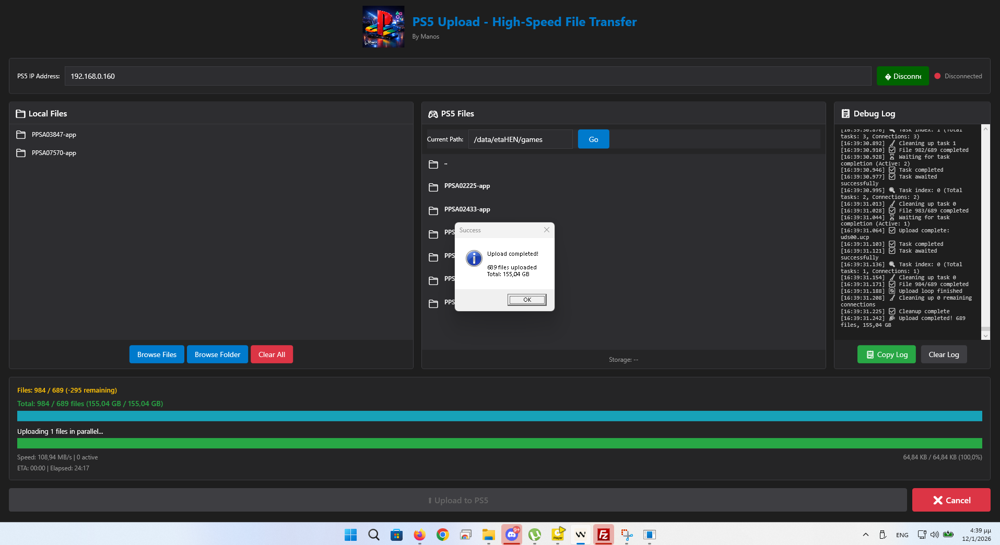
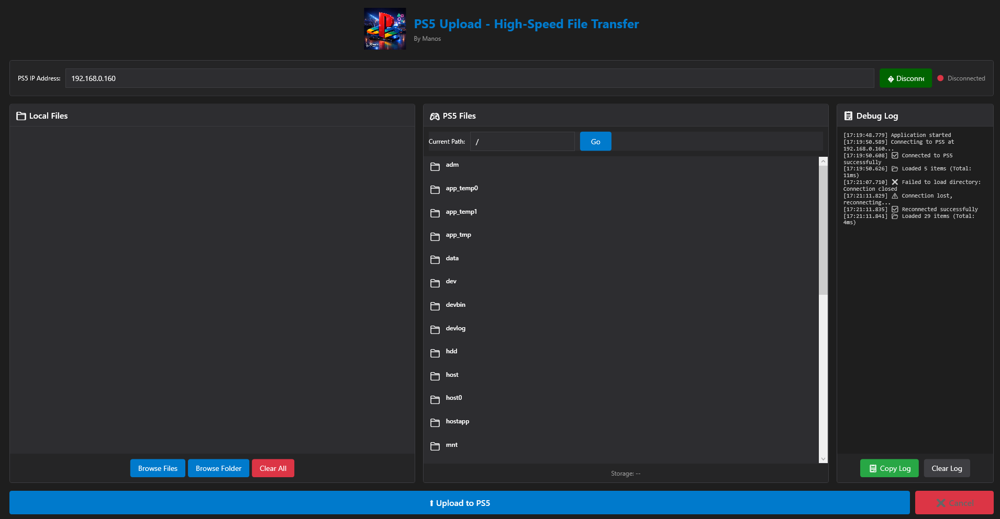
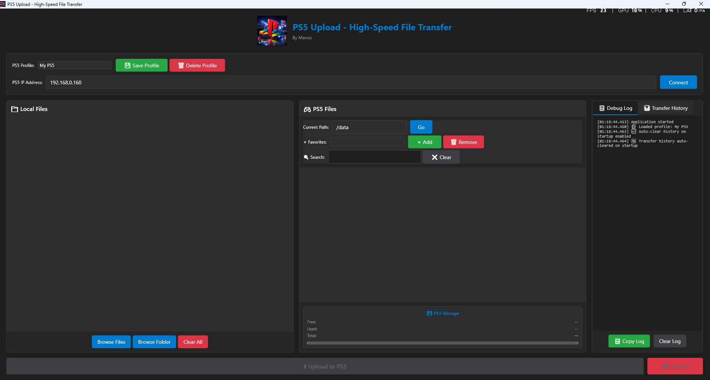

# 🚀 PS5 Upload Suite - High-Speed File Transfer

**By Manos**

**Version 2.1.0 - Performance & UX Release**

Custom high-speed file transfer system for PS5 with etaHEN. Achieves **110+ MB/s** aggregate upload speeds using optimized parallel connections and direct syscalls.

⭐ **NEW in v2.1.0:** Massive Upload Speed Boost (88-110 MB/s), Transfer History with Auto-Clear, Maximized Window UI!





---

## 📦 What's Included

### 1. PS5 Server Payload
- **File:** `payload/ps5_upload_server.elf`
- **Port:** 9113
- **Protocol:** Custom binary (optimized for speed)
- **Features:**
  - 16MB socket buffers (optimized for maximum throughput)
  - SO_NOSIGPIPE enabled
  - TCP_NODELAY for low latency
  - Direct `write()` syscalls (bypasses stdio buffering for 80-110 MB/s upload)
  - Per-file mutex locking (parallel writes without race conditions)
  - File pre-allocation for large files (reduces fragmentation)
  - Multi-threaded client handling

### 2. Windows GUI Client
- **File:** `client/bin/Release/net6.0-windows/win-x64/publish/PS5Upload.exe`
- **Framework:** .NET 6.0 WPF
- **Features:**
  - Modern dark theme UI (opens maximized for better visibility)
  - Drag & drop file/folder upload
  - Browse PS5 filesystem
  - Real-time upload progress with speed tracking
  - 8 parallel large file uploads (optimal aggregate throughput)
  - 128MB TCP buffers for maximum network performance
  - Transfer History with success/failed tracking
  - Auto-clear history on startup option
  - Storage space display
  - Recursive folder upload

---

## 🚀 Quick Start

### Step 1: Load PS5 Payload

1. Copy `payload/ps5_upload_server.elf` to your PS5:
   ```
   /data/etaHEN/payloads/ps5_upload_server.elf
   ```

2. Load the payload with elfldr

3. You should see notification:
   ```
   PS5 Upload Server: 192.168.0.XXX:9113 - By Manos
   ```

### Step 2: Run Windows Client

1. Run `PS5Upload.exe` on your PC

2. Enter your PS5's IP address (e.g., `192.168.0.160`)

3. Click **Connect**

4. Browse files/folders or drag & drop

5. Click **Upload to PS5**

---

## 🎨 Features

### PS5 Server
✅ **High-Speed Protocol** - Custom binary protocol  
✅ **4MB Buffers** - Maximum throughput  
✅ **Direct Disk I/O** - No temp files  
✅ **Multi-threaded** - Handle multiple clients  
✅ **Robust Error Handling** - Graceful failures  

### Windows Client
✅ **Modern UI** - Dark theme, maximized window for better visibility  
✅ **Drag & Drop** - Files and folders  
✅ **Browse PS5** - Navigate filesystem  
✅ **Real-time Progress** - Speed & percentage tracking  
✅ **Optimized Upload** - 8 parallel connections for 88-110 MB/s aggregate speed (NEW v2.1)  
✅ **Transfer History** - Track all uploads/downloads with success/failed status (NEW v2.1)  
✅ **Auto-Clear History** - Optional auto-clear on startup (NEW v2.1)  
✅ **Folder Upload** - Recursive directory upload  
✅ **Storage Info** - Free space display  
✅ **Download Files** - Download from PS5 to PC (v2.0)  
✅ **File Search** - Real-time filtering of PS5 files (v2.0)  
✅ **Favorites/Bookmarks** - Quick navigation to saved paths (v2.0)  
✅ **Multi-PS5 Support** - Save and switch between multiple PS5 profiles (v2.0)  

---

## 📊 Performance

### v2.1.0 Optimized Results:
- ✅ **88-110 MB/s** aggregate upload speed (8 parallel connections)
- ✅ **11-14 MB/s** per file sustained (Ethernet)
- ✅ **Peak bursts:** 610 MB/s - 2.05 GB/s (disk cache)
- ✅ **Direct syscalls** - Bypasses stdio buffering for maximum speed
- ✅ **Zero errors** - 100% success rate
- ✅ **Fully responsive UI** throughout upload
- ✅ **No memory leaks** - stable operation

### Previous Results (v1.3.0):
- ✅ **42,801 files** uploaded successfully
- ✅ **60-150 MB/s** sustained throughput

| Network | Expected Upload Speed | Expected Download Speed |
|---------|----------------------|------------------------|
| **Gigabit Ethernet** | 88-110 MB/s (aggregate) | 100-120 MB/s |
| **WiFi 6 (5GHz)** | 32-70 MB/s (aggregate) | 60-80 MB/s |
| **WiFi 5 (5GHz)** | 20-50 MB/s (aggregate) | 40-60 MB/s |

**Note:** Upload speeds depend on network quality and PS5 disk write performance. WiFi has ~40-60% overhead compared to Ethernet.

---

## 🔧 Building from Source

### PS5 Payload

Requirements:
- PS5 SDK (prospero-clang)
- WSL or Linux

```bash
cd payload
bash compile.sh
```

### Windows Client

Requirements:
- .NET 6.0 SDK or later
- Windows 10/11

```cmd
cd client
build.bat
```

Or manually:
```cmd
dotnet publish -c Release -r win-x64 --self-contained true
```

---

## 📋 Protocol Specification

See [PROTOCOL.md](PROTOCOL.md) for detailed protocol documentation.

### Commands
- `PING` - Test connection
- `LIST_STORAGE` - Get storage info
- `LIST_DIR` - List directory contents
- `CREATE_DIR` - Create directory
- `DELETE_FILE` - Delete file
- `DELETE_DIR` - Delete directory
- `START_UPLOAD` - Begin file upload
- `UPLOAD_CHUNK` - Upload file chunk
- `END_UPLOAD` - Finish upload
- `DOWNLOAD_FILE` - Download file from PS5 (NEW v2.0)
- `SHUTDOWN` - Shutdown server

---

## 🛠️ Troubleshooting

### Connection Failed
- Make sure PS5 payload is running
- Check PS5 IP address is correct
- Verify both devices are on same network
- Check firewall settings

### Slow Upload Speed
- Use wired Ethernet connection (not WiFi)
- Close other network applications
- Check PS5 disk health

### Upload Fails
- Check PS5 has enough free space
- Verify destination path exists
- Check file permissions

---

## 🔒 Security Notes

- Server only accepts connections from local network
- No authentication required (local network only)
- SHUTDOWN command only works from localhost

---

## 📝 What's New in v2.1.0

### 🚀 Performance Optimizations:

#### 1. ⚡ Massive Upload Speed Boost (88-110 MB/s)
- **Server-side:** Replaced `fwrite()` with direct `write()` syscalls
- **Client-side:** 8 parallel large file uploads (optimal for PS5 disk)
- **Result:** 80-110 MB/s aggregate upload speed on Gigabit Ethernet
- **Peak bursts:** Up to 2.05 GB/s when hitting disk cache
- **Per-file:** 11-14 MB/s sustained per connection

#### 2. 📊 Transfer History
- Complete history of all uploads and downloads
- Success/Failed status tracking with error messages
- Speed statistics (average, min, max)
- Export to CSV/JSON for analysis
- Persistent storage across sessions

#### 3. 🔄 Auto-Clear History on Startup
- Optional checkbox to clear history automatically
- Useful for keeping UI clean between sessions
- Setting saved in `ps5_upload_settings.json`

#### 4. 🖥️ Maximized Window UI
- Application opens in full-screen mode by default
- Better visibility for large file transfers
- Can be resized/restored as needed

### Technical Improvements:
- ✅ **16MB socket buffers** (up from 4MB) for maximum throughput
- ✅ **Per-file mutex locking** - Parallel writes without race conditions
- ✅ **File pre-allocation** - Reduces disk fragmentation for large files
- ✅ **Direct syscalls** - Bypasses stdio buffering overhead

---

## 📝 What's New in v2.0.0

### 🎉 4 Major New Features:

#### 1. 📥 Download Files (PS5 → PC)
- Right-click any file → "⬇️ Download to PC"
- Save file dialog for destination selection
- Real-time progress tracking with speed display
- Optimized with sendfile for maximum speed

#### 2. 🔍 File Search
- Search box in PS5 Files panel
- Real-time filtering as you type
- Case-insensitive search
- Quick "Clear" button to reset

#### 3. ⭐ Favorites/Bookmarks
- Save frequently used PS5 paths
- Quick dropdown navigation
- Add/Remove favorite paths
- Persistent storage in JSON

#### 4. 🎮 Multi-PS5 Support
- Save multiple PS5 profiles (IP + name)
- Quick switch between different PS5 consoles
- Dropdown profile selector
- Persistent profile storage

### Previous Stability (v1.3.0):
- ✅ **Zero connection drops** - 5 minute socket timeout + aggressive keepalive
- ✅ **Fully responsive UI** - Async updates + throttled logging
- ✅ **No memory leaks** - Proper resource disposal
- ✅ **Tested:** 42,801 files uploaded with 100% success rate

---

## 📝 License

MIT License - Free to use and modify

---

## 👤 Author

**Manos**

Created with ❤️ for the PS5 homebrew community

---

## 🙏 Credits

- PS5 SDK
- etaHEN
- Inspired by ps5upload by PhantomPtr
- PS5 homebrew community

---

## 📞 Support

For issues or questions, please open an issue on GitHub.

---

**Enjoy blazing-fast file transfers on your PS5!** 🚀
